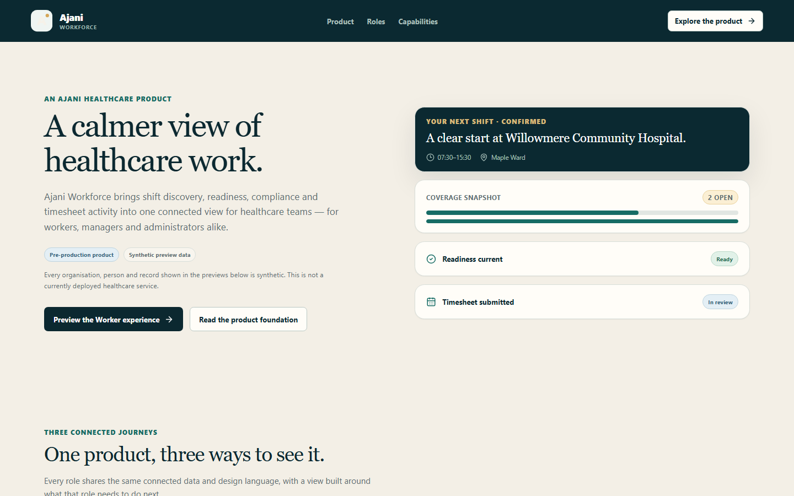
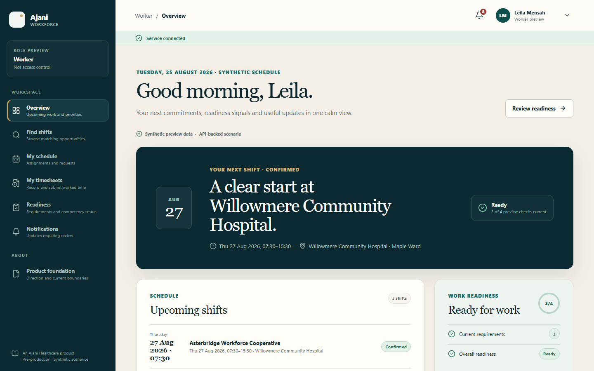
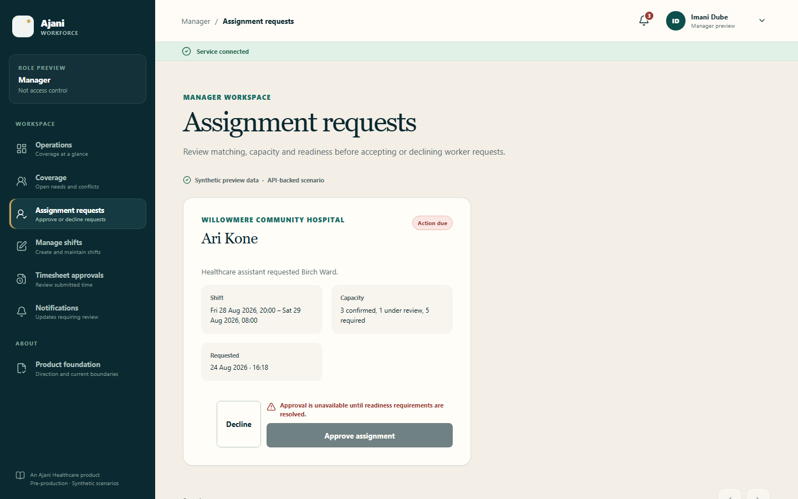
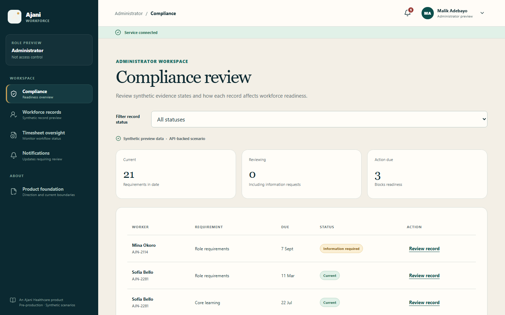
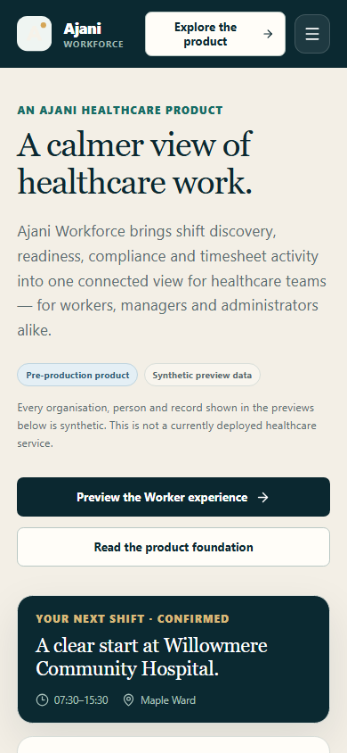
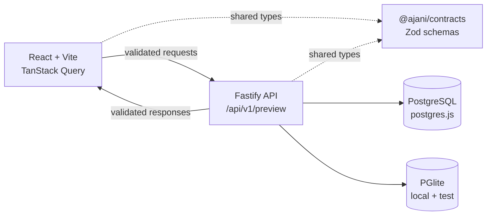

# Ajani Workforce

A pre-production healthcare-workforce platform from Ajani Healthcare, connecting Worker shift and timesheet journeys, Manager operations, and Administrator compliance review in one system.

**[Open the live interactive preview](https://workforce.ajanihealthcare.com)**

**Pre-production product · Synthetic preview data · Not deployed for live healthcare operations**

Ajani Workforce is a genuine Ajani Healthcare product, currently in pre-production and intended for future operational use. Ajani Healthcare itself is a genuine operating business, but the workforce organisations, preview personas, and operational records shown inside this application are fictional and synthetic. A public interactive preview is successfully deployed, using this synthetic preview data only — it remains pre-production and is not used for live healthcare operations, and contains no real patient or workforce data. This pre-production release also serves as an engineering and product-design showcase.



## What it does

Ajani Workforce connects shift discovery, assignment decisions, compliance readiness, and timesheet activity through a relational PostgreSQL model, deterministic synthetic data, versioned APIs, and a responsive React interface. A Worker requesting a shift, a Manager approving it, and an Administrator confirming the Worker's compliance readiness all read and write the same coherent, transactionally-consistent state — reflected live across every connected view.

Authentication and authorization are not implemented. Role selection changes only the displayed synthetic persona and is not a security boundary.

## Three connected role journeys

### Worker

Workers discover eligible shifts with location and availability filters, request and cancel assignments, track readiness against compliance requirements, and draft, submit, correct, and resubmit timesheets.



### Manager

Managers review assignment requests against live capacity and readiness, author and publish future shifts, and approve or reject submitted timesheets. Every decision revalidates the underlying rules at the moment of action — the screenshot below shows an approval blocked because the Worker's readiness requirements are not yet resolved, enforced by the same transaction that would otherwise confirm the assignment.



### Administrator

Administrators review compliance evidence, decide outstanding records, and see how each decision recalculates the Worker's effective readiness — the same readiness value Workers and Managers act on.



The interface reflows for touch and narrow screens without hiding meaning or overflowing horizontally:



## Engineering highlights

**Data and concurrency**
- A PostgreSQL schema with reviewed SQL migrations, constraints, indexes, and typed Drizzle mappings; PGlite for self-contained local development and testing, with explicit external PostgreSQL configuration through postgres.js.
- A canonical transactional row-lock order (actor, readiness-sensitive Worker profile, shift, assignments in stable order, then compliance record) that resolves last-place capacity races to exactly one winner.
- Optimistic version checks, actor-scoped UUID idempotency, and transactional notifications/activity for every operations mutation — matching replays return the stored result, contradictory reuse and stale versions return safe `409` errors.
- A dedicated CI job runs three deterministic concurrency tests against real PostgreSQL, not just PGlite.

**API and contracts**
- Runtime-validated Zod contracts shared between server and browser, with consistent success, cursor-pagination, and safe error envelopes across a versioned `/api/v1/preview` surface.
- Idempotent deterministic seed data supporting linked Worker, Manager, and Administrator scenarios, verified by a clean-migrate-seed-reset-compare cycle in CI.

**Frontend and accessibility**
- A typed TanStack Query client with cancellation, bounded retries, non-retrying idempotent mutations, coherent invalidation, and explicit loading, empty, offline, error, conflict, retry, recovery, and success states.
- Semantic landmarks, visible focus, skip navigation, focus-contained dialogs and drawers, reduced-motion support, and labelled responsive tables, gated by automated axe accessibility checks on representative role routes.
- Route-group code splitting under an enforced production JavaScript budget.

**CI and delivery**
- Least-privilege CI covering locked installation, lint, full typechecks, unit suites, deterministic database delivery, production builds and dependency audit, Chromium browser journeys, accessibility, and a separate PostgreSQL concurrency job.

## Architecture

Ajani Workforce is a modular monolith: a browser application, a Fastify API, shared runtime contracts, and a PostgreSQL data workspace.



```text
apps/
  api/        Fastify routes, services, process lifecycle, and API tests
  web/        React, Vite, TanStack Query, and responsive product previews
packages/
  contracts/  Shared Zod schemas and inferred transport types
  database/   Drizzle schema, SQL migrations, seed, repository, and tests
docs/         Architecture, decisions, delivery, operations, and product documentation
e2e/          Critical browser journeys and axe accessibility checks
```

See [architecture overview](docs/architecture/overview.md) and [data foundation](docs/architecture/data-foundation.md) for the full system context, entity relationships, and API envelope shapes.

## Local setup

Requires Node.js 24.19.0 and npm 11.17.0, pinned in `package.json`, `.nvmrc`, and `.node-version`.

```powershell
npm.cmd ci
npm.cmd run dev
```

`pglite` is the default data mode — no environment file is required. On first API startup, all reviewed migrations are applied and a deterministic synthetic preview seed is inserted into the ignored `.ajani-data/pglite` directory. The web application runs at `http://127.0.0.1:5173`, the API at `http://127.0.0.1:3000`, and Vite proxies `/api`, `/health`, `/live`, and `/ready` to Fastify.

| Mode | Configuration | Behaviour |
| --- | --- | --- |
| PGlite | `AJANI_DATA_MODE=pglite` or unset | Local default using the ignored data directory; API startup migrates and seeds idempotently. |
| PostgreSQL | `AJANI_DATA_MODE=postgres` and `DATABASE_URL=postgresql://…` | Uses external PostgreSQL through postgres.js; missing or invalid configuration fails without fallback. Migrations and seed remain explicit commands. |

## Verification and test coverage

Every change is verified by `npm.cmd run verify` (lint, typecheck, unit tests, builds, bundle budget, and deterministic database delivery) plus a separate browser and PostgreSQL gate in CI:

| Suite | Coverage |
| --- | --- |
| Database | 56 tests — clean migration, seed, constraints, repository workflows, and PostgreSQL-mode configuration safety |
| Web | 66 tests — routes, API-driven state, interaction, accessibility |
| API | 77 tests — health and versioned preview endpoints |
| Browser journeys and accessibility | 17 tests — Chromium journeys and axe gates across role routes |
| Real PostgreSQL integration | 7 tests — last-place contention concurrency (3) and hosted-preview migrate-reset-seed behaviour (4), run separately in CI |

<details>
<summary>Command reference</summary>

| Command | Purpose |
| --- | --- |
| `npm.cmd run dev` | Start the complete web and API preview. |
| `npm.cmd run db:migrate` | Build the database workspace and apply reviewed migrations. |
| `npm.cmd run db:seed` | Apply migrations and idempotently insert synthetic preview data. |
| `npm.cmd run db:reset:preview` | Reset only known preview rows; PGlite only. |
| `npm.cmd run db:verify` | Apply a clean temporary migration, seed twice, reset, and compare deterministic snapshots. |
| `npm.cmd run lint` | Run type-aware repository linting. |
| `npm.cmd run typecheck` | Run strict TypeScript checks for every workspace and the browser suite. |
| `npm.cmd run test:database` | Run clean-migration, seed, constraint, and repository tests. |
| `npm.cmd run test:web` | Run web route, API-state, interaction, and accessibility tests. |
| `npm.cmd run test:api` | Run health and versioned preview API tests. |
| `npm.cmd run test:e2e` | Build and run isolated Chromium journeys and accessibility checks. |
| `npm.cmd run test:e2e:accessibility` | Run only the representative axe and reduced-motion browser gate. |
| `npm.cmd run test:postgres` | Run the separate real-PostgreSQL concurrency and hosted-preview reset tests when `AJANI_POSTGRES_TEST_URL` is available. |
| `npm.cmd run build:web` | Type-check and build the Vite application. |
| `npm.cmd run build:api` | Build contracts, database, and API workspaces. |
| `npm.cmd run check:bundle` | Enforce production JavaScript entry, chunk, and total budgets. |
| `npm.cmd run verify` | Run lint, typecheck, unit tests, builds, bundle budget, and deterministic database delivery verification. |

Install the Chromium runtime once with `npx playwright install chromium` before local browser testing.

</details>

<details>
<summary>Versioned preview API reference</summary>

All preview responses carry a UUID request ID, generation timestamp, and `synthetic-preview` source. Collection endpoints add cursor pagination metadata. Errors use a stable code, user-safe message, request ID, and optional field details.

| Method and route | Purpose |
| --- | --- |
| `GET /health` | Existing service-health contract. |
| `GET /live` | Explicit process liveness alias. |
| `GET /ready` | Database-backed readiness without internal configuration disclosure. |
| `GET /api/v1/preview/workers/:workerId/overview` | Worker schedule, readiness summary, and activity. |
| `GET /api/v1/preview/workers/:workerId/readiness` | Worker requirement detail. |
| `GET /api/v1/preview/workers/:workerId/shifts` | Filtered, cursor-paginated shift discovery with effective eligibility. |
| `GET /api/v1/preview/workers/:workerId/shifts/:shiftId` | Shift detail, capacity, arrival information, and eligibility. |
| `GET /api/v1/preview/workers/:workerId/schedule` | Cursor-paginated confirmed, under-review, and cancelled assignments. |
| `POST /api/v1/preview/workers/:workerId/shift-assignments` | Idempotent, transactional shift request. |
| `POST /api/v1/preview/workers/:workerId/shift-assignments/:assignmentId/cancel` | Idempotent, transactional future-assignment cancellation. |
| `GET /api/v1/preview/workers/:workerId/timesheets` | Filtered timesheets and eligible completed assignments. |
| `POST /api/v1/preview/workers/:workerId/timesheets` | Save one idempotent draft for an eligible assignment. |
| `GET /api/v1/preview/workers/:workerId/timesheets/:timesheetId` | Worker-scoped timesheet detail. |
| `PUT /api/v1/preview/workers/:workerId/timesheets/:timesheetId` | Correct a draft or rejected timesheet with version checking. |
| `POST /api/v1/preview/workers/:workerId/timesheets/:timesheetId/submit` | Submit or resubmit an idempotent timesheet. |
| `GET /api/v1/preview/managers/:managerId/operations` | Organisation coverage metrics and alerts. |
| `GET /api/v1/preview/managers/:managerId/coverage` | Bounded coverage window. |
| `GET /api/v1/preview/managers/:managerId/assignment-requests` | Cursor-paginated assignments awaiting review. |
| `POST /api/v1/preview/managers/:managerId/assignment-requests/:assignmentId/decision` | Approve or decline with capacity and version revalidation. |
| `GET, POST /api/v1/preview/managers/:managerId/shifts` | List scoped shifts or create a future draft. |
| `GET, PATCH /api/v1/preview/managers/:managerId/shifts/:shiftId` | Read or edit a future draft. |
| `POST /api/v1/preview/managers/:managerId/shifts/:shiftId/publish` | Publish a valid draft. |
| `POST /api/v1/preview/managers/:managerId/shifts/:shiftId/cancel` | Cancel a future shift and its active assignments transactionally. |
| `GET /api/v1/preview/managers/:managerId/timesheets` | Filtered organisation timesheets for review. |
| `POST /api/v1/preview/managers/:managerId/timesheets/:timesheetId/decision` | Approve or reject submitted time. |
| `GET /api/v1/preview/administrators/:administratorId/compliance` | Filtered cursor-paginated readiness register. |
| `GET /api/v1/preview/administrators/:administratorId/compliance-records` | Filtered cursor-paginated evidence records and counts. |
| `GET /api/v1/preview/administrators/:administratorId/compliance/:recordId` | Record detail and review history. |
| `POST /api/v1/preview/administrators/:administratorId/compliance/:recordId/decision` | Persist a review outcome and recalculate readiness. |
| `GET /api/v1/preview/administrators/:administratorId/records` | Cursor-paginated workforce records. |
| `GET /api/v1/preview/administrators/:administratorId/timesheets` | Read-only lifecycle oversight and summary counts. |
| `GET /api/v1/preview/notifications?recipientId=<uuid>` | Cursor-paginated recipient notifications. |

`/worker/shifts`, `/worker/schedule`, and `/worker/timesheets` expose the Worker journey; `/manager/requests`, `/manager/shifts`, and `/manager/timesheets` expose Manager operations; `/administrator/compliance`, `/administrator/records`, and `/administrator/timesheets` expose Administrator oversight. Successful mutations persist only synthetic data and are restored by `npm.cmd run db:reset:preview`.

</details>

## Security and intentional limitations

- Authentication, authorization, account provisioning, and real access decisions are not included in this pre-production preview; persona selection is a preview only, not a security boundary.
- Document upload, evidence-file storage, payroll, invoicing, expenses, tax, messaging, and production notifications are not implemented.
- All mutations operate only on deterministic synthetic preview records; time-sensitive rules use a fixed injected instant rather than the real wall clock.
- PGlite is a local preview and test engine, not a production-scale claim; public PGlite hosting must use one writer and an explicit writable data path.
- CI runs three bounded concurrency tests against real PostgreSQL through the existing adapter — this does not establish production credentials, backups, monitoring, high availability, or complete external-database operations.
- A public pre-production preview is deployed at the URL above; this is not a live healthcare operation, and no customer usage, healthcare certification, or third-party healthcare integration is claimed.

See [SECURITY.md](SECURITY.md) for the full reporting policy and preview boundaries.

## Further technical documentation

- [Architecture overview](docs/architecture/overview.md) and [data foundation](docs/architecture/data-foundation.md)
- [Architecture decision records](docs/decisions/)
- [Product and UX case study](docs/product/ux-case-study.md) and [design system](docs/product/design-system.md)
- [Hosting-neutral delivery contract](docs/delivery/hosting-contract.md) and [operational runbook](docs/operations/runbook.md)
- [Public preview deployment and operations](docs/delivery/public-preview-deployment.md) — the verified Netlify (frontend), Render (API), and Neon (database) topology behind the deployed public preview, including provider configuration, startup and reset behaviour, and rollback guidance
- [Contributor guide](CONTRIBUTING.md)

## Licence

This repository is source-available for evaluation, not open source. Viewing, cloning, local execution, and evaluation are permitted; production use, commercial exploitation, and redistribution are not. See [LICENSE.md](LICENSE.md) for the complete terms. Copyright (c) 2026 Ajani Healthcare Limited.
